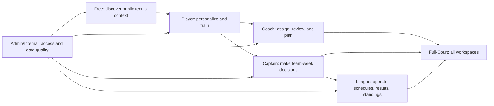
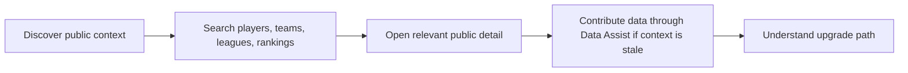
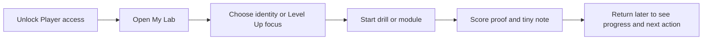
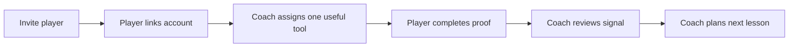
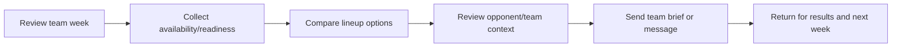
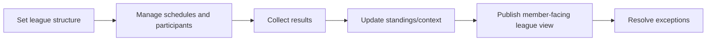
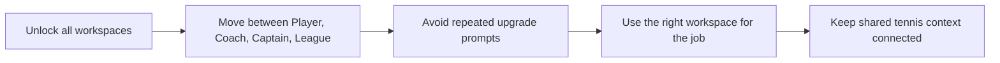
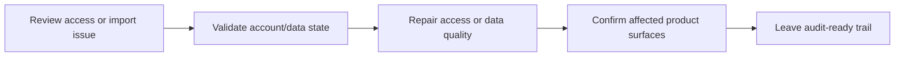

# TenAceIQ Customer Journey Process Map

Use this as the technical reference for journey testing by tier. The source of truth for feature status, pain points, verification mode, and next closeout steps is `lib/platform-closeout-inventory.ts`. The typed testing agenda lives in `docs/customer-journey-test-plan.md`; the manual test playbook lives in `docs/customer-journey-test-scripts.md`; the account/data fixture plan lives in `docs/customer-journey-test-fixtures.md`.

Run `npm run qa:matrix` to print the tier-by-feature matrix while testing.

## How To Use This

1. Pick the tier.
2. Walk the journey from entry to return.
3. For each feature, verify the pain point is actually solved.
4. Mark whether the feature is `backend-backed`, `local`, `mock`, `manual`, or `blocked`.
5. Update `lib/platform-closeout-inventory.ts` first when the map changes, then update this doc.

## Journey Stages

| Stage | Meaning | Test Question |
| --- | --- | --- |
| Discover | User finds useful tennis context before committing. | Can the user understand where to start and why the product matters? |
| Unlock | User activates or links the right access. | Does the user clearly get into the right tier/workspace without confusion? |
| Plan | User chooses what to do next. | Does the product turn context into a useful next action? |
| Act | User performs the work. | Is the workflow fast, practical, and tennis-specific? |
| Track | User records a short signal. | Can the user save numbers first with one small note when useful? |
| Review | Coach/captain/admin reviews signals. | Does the reviewer see what matters and what should happen next? |
| Share | The product makes status visible to the right people. | Can the right people see schedules, results, proof, or updates? |
| Operate | Coordinator runs the structure. | Can the operator manage the competition without spreadsheet chaos? |
| Return | User comes back later and sees progress. | Does the product remember what happened and pull it forward? |
| Admin | Internal user protects access and data quality. | Can internal workflows repair access/data without product drift? |

## Tier Flow Map

## Core Customer Journeys

### Free

Pain being solved: a visitor should not have to guess where tennis context lives or what unlocks next.

### Player

Pain being solved: players need a simple way to turn lessons, goals, and practice time into visible progress.

### Coach

Pain being solved: coach and player alignment should continue between lessons without long journals or disconnected homework.

### Captain

Pain being solved: captains need to make lineup and communication decisions without rebuilding context in scattered tools.

### League

Pain being solved: coordinators need one operating workspace for schedules, results, standings, and visibility.

### Full-Court

Pain being solved: multi-role users need clean access across every workspace without tier confusion.

### Admin/Internal

Pain being solved: internal users need to keep access and tennis intelligence trustworthy without creating product drift.

## Feature Access And Pain Point Matrix

| Tier | Feature | Stage | Route | Pain Point | Status | Verification |
| --- | --- | --- | --- | --- | --- | --- |
| Free | Public Explore | Discover | `/explore` | Visitors do not know where to start or how to understand the tennis landscape around them. | backend-backed | automated |
| Free | Data Assist Entry | Act | `/data-assist` | Users have updated scorecards, schedules, or rosters but no clear way to turn them into trusted platform context. | manual | manual |
| Player | My Lab | Return | `/mylab` | Players see tennis data in fragments and need one personal home that tells them what matters next. | backend-backed | manual |
| Player | Level Up Portal | Act | `/player-development/[identity]/level-up` | Players leave lessons without an easy on-court way to choose a focus, train it, and log proof quickly. | local | automated |
| Player | Level Up Content Library | Plan | `/player-development/[identity]/level-up` | Training libraries can become generic, making it hard for players to know which drill actually helps their game. | backend-backed | automated |
| Coach | Coach Hub | Review | `/coach` | Coaches need one place to see students, assigned work, proof, and the next lesson focus between sessions. | backend-backed | automated |
| Coach | Coach Invite Link | Unlock | `/coach/invite/[token]` | Coach-player alignment breaks when the player is not linked to the coach inside the platform. | backend-backed | needs-account |
| Coach | Coach Lesson Planner | Plan | `/player-development/[identity]/coach-planner` | Lesson plans can drift away from the player identity, assigned work, and readiness signals. | manual | manual |
| Captain | Captain Lineup Week | Plan | `/captain` | Captains make weekly lineup decisions with scattered availability, readiness, scouting, and communication. | local | manual |
| Captain | Compete Bridge | Discover | `/compete` | Team context, schedules, and results can feel disconnected from the captain actions they should inform. | manual | manual |
| League | League Office | Operate | `/league-coordinator` | Coordinators often run structure, schedules, results, standings, and visibility across too many manual tools. | backend-backed | manual |
| League | Public League Context | Share | `/leagues/[league]` | Members need a clear public or member-facing place to see league schedule, result, and standings context. | backend-backed | automated |
| Full-Court | Full-Court Navigation | Unlock | `/pricing` | Multi-role users need all workspaces without repeated locks, duplicated prompts, or unclear role switching. | manual | manual |
| Admin/Internal | Admin Access Management | Admin | `/admin/access` | Internal users need to activate and repair access without creating tier drift or billing confusion. | backend-backed | manual |
| Admin/Internal | Admin Data Quality | Admin | `/admin/import-queue` | Imported tennis data needs review before it changes match history, rankings, player context, or league intelligence. | manual | manual |

## Next Week Test Order

1. Player Level Up mobile loop.
2. Coach invite to player link to assigned challenge.
3. Coach review to lesson planner alignment.
4. Player My Lab return state and progress visibility.
5. Captain week flow.
6. League coordinator result flow to public league context.
7. Full-Court no-stale-lock access pass.
8. Admin access activation and data quality pass.

## Update Rule

When a feature changes, update this order:

1. `lib/platform-closeout-inventory.ts`
2. `lib/customer-journey-test-plan.ts`
3. `docs/customer-journey-process-map.md`
4. `docs/customer-journey-test-plan.md`
5. `docs/customer-journey-test-scripts.md`
6. `docs/customer-journey-test-fixtures.md`
7. Relevant route, smoke, or unit tests
8. `docs/platform-closeout-qa.md` if the closeout status changes
